- **Author:** Chad Jarvis
- **Date:** August 12, 2024

Element-wise operations apply a function to each element of a tensor with no
dependence between elements. The simplest element-wise operations is `memcpy`
(or perhaps `memset`).

In terms of the BLAS routines the Level 1 vector-vector methods, such as `dot
product`, are element-wise operations. However, the Level 2 operations, such as
`gemv`, and the Level 3 operations such as `gemm`, are not elementw-wise
operations.

Because there is no data re-usage, element-wise operations are often memory
bandwidth bound. However, some cases could be compute bound. For example
generating the Mandelbrot set can be implemented as an element-wise operation.

## Peak global memory bandwidth

Since most operations are memory bandwidth bound it’s useful to know what the
peak global memory bandwidth is. This can be computed using the following
formulas:

```plaintext
GB/s = bus-width (in bytes) * (transfers per cycle) * memory clock (GHz)
```

or

```plaintext
GB/s = bus-width (in bytes) * Gbps
```

where

```plaintext
Gbps = (transfers per cycle) * Ghz
```

The following table gives the number of transfers per cycle
that are available to different memory types:

| Memory Type | How many times data can be sent per clock cycle |
|-------------|-------------------------------------------------|
| GDDR6X      | 16 |
| GDDR6/GDDR5x | 8 |
| SDR (or other single data rate memory types) | 1 |
| Everything else including DDR, DDR2, DDR3, DDR4, HBM, HBM2, HBM3, etc | 2 |

For typical accelerators, we have this table of bandwidths:

|  | GB/s | bus-width bits | memory clock GHz | transfers/cycle | Gbps | memory type |
| --- | --- | --- | --- | --- | --- | --- |
| A100 80 GB | 1935 | 5120 | 1.512 | 2 | 3.024 | HBM2E |
| A100 40 GB | 1555 | 5120 | 1.215 | 2 | 2.43 | HBM2 |
| A10 | 600 | 384 | 1.5625 | 8 | 12.5 | GDDR6 |
| L4 | 300 | 192 | 1.5625 | 8 | 12.5 | GDDR6 |

With cache sizes of:

|  | L2 cache | L1 cache | SMs |
| --- | --- | --- | --- |
| A100 | 40 MiB | 21168 KiB = 192 KiB * 108 | 108 |
| A10 | 6 MiB | 10240 KiB = 128 KiB * 80 | 80 |
| L4 | 48 MiB |   7168 KiB = 128 KiB * 56 | 56 |

Some important observations from these tables

- The L4 has the lowest bandwidth (5x lower than the A100 40 GB and 2x slower
  than the A10) but the largest L2 cache.
- The A10 L2 cache is 6.6 - 8 times smaller than the A100 and L4 L2 cache.
- The A100 uses HBM2 but the A10 and L4 use GDDR6.

---

## Element-wise performance

Note that in all benchmarks I changed

```mojo
var N = product(dims, rank)
var num_bytes = N * sizeof[[type]()
```

to

```mojo
var num_bytes = 2 * N * sizeof[[type]()
```

Because both reads and writes are done so the total bytes is twice.

### Peak memory bandwidth benchmarks

The following charts show the peak memory bandwidth of different accelerators
based on internal benchmarking.

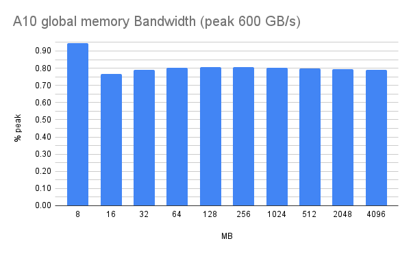

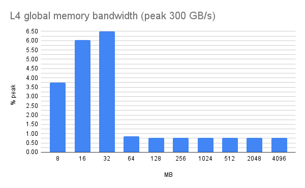

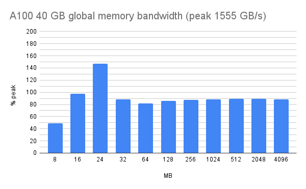

Observations:

- With the L4 we get more than peak bandwidth for 32 MiB and smaller. The L2
  cache size is 48 MiB so it seems that bandwidth could be the L2 bandwidth.
- The A10 has has only a 6 MiB L2 cache and the smallest size measured is 8
  MiB. But with 8 MiB the bandwidth is clearly higher than larger sizes.
- With the A100 we don’t see the effect of the L2 cache for some reason accept
  at 24 MiB.

The A100 uses HBM2 and the A10 and L4 use GDDR6. This could explain some of the
the differences in the bandwidth measurements. Could also be a difference
between Ampere `sm_80` and Ada Lovelace `sm_89`.

### Benchmarking of baby-replit kernels

Analysis of baby-replit CE and TG kernels shows:

|  | baby-replit-CE-kernels | baby-replit-TG-kernels |
| --- | --- | --- |
| DimList | (1, 1024, 3072) | (1, 8, 3, 1025, 128) |
| elements | 3145728 | 3148800 |
| bytes float32 | 24 MiB  | 24 .02 MiB |
| bytes bfloat16 | 12 MiB | 12.01 MiB |

This means that the baby-replit shapes fit in the A100 L2 cache (40 MiB) and
the L4 L2 cache (48MiB) but not the A10 L2 cache (6MiB) i.e. the A10 benchmark
should be mostly memory bandwidth bound but the A100 and L4 could depend on the
L2 bandwidth or maybe L1 bandwidth.

I improved the `add_const` function for `bfloat16` to use the  `bfloat16` `fma`
function instead of upcasting to `float32` and then downcasting back to
bfloat16. I also optimized the `log` function to use the `log2` instruction for
`float32`. All the following results have these optimizations.

Since baby-replit-CE-kernels and baby-replit-TG-kernels have almost the same
number of elements to keep it simpler I only looked at `baby-replit-CE-kernel`.

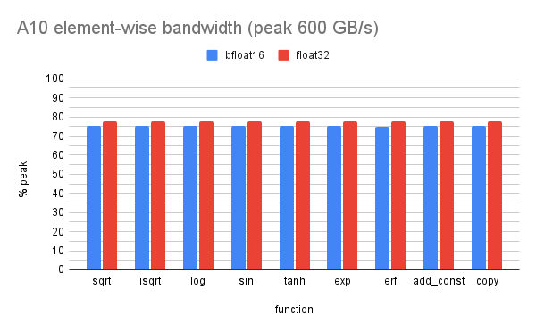

Every measurement appears to be global memory bandwidth bound. The L2 cache
size is only 6 MiB and the bytes transferred is at least 12 MiB (`bfloat16`).
The bandwidth is only about 75% of peak. Perhaps it’s possible this could be a
bit better. This plot makes sense!

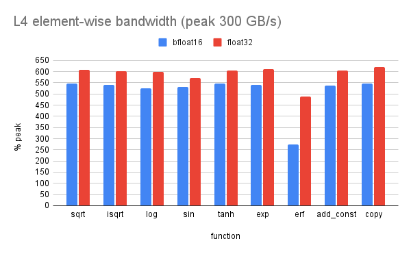

Every measurement is more than peak likely due to the sizes easily fitting in
the 48 MiB L2 cache. The `erf` is clearly not optimized and is more compute
than bandwidth bound. Also, `bfloat16` is clearly slower than `float32` in
general. This plot makes sense if we assume it’s measuring the L2 bandwidth and
not global memory bandwidth.

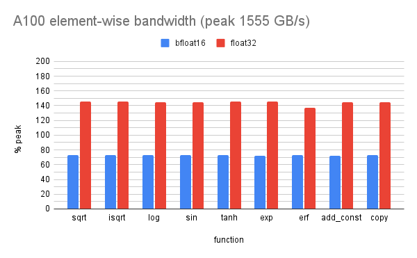

Notice that `float32` is roughly twice as fast as `bfloat16`. The `erf`
function also a bit slower. The sizes all fit in the 40 MiB L2 cache. So why is
performance only more than peak at 24 MiB and why  is `bfloat16` so much slower
than `float32`? This plot makes no sense.

If I double the number of elements from `1024x3072` to `2048*3072`  I get this
plot

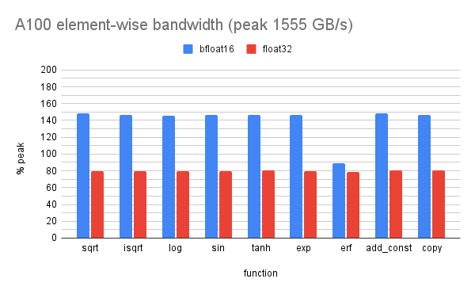

Now the roles between `float32` and `bfloat16` have flipped (except for `erf`)
Why is this?

With `1024x3072` the bytes transferred with `float32` is 24 MiB but only 12 MiB
with `bfloat16` . But with `2048x3072` with `float32` is 48 MiB and bfloat16 is
24 MiB. Why does this matter?

The L2 cache is 40 MiB so the measurement appears to still be dominated by the
L2 cache. However, the L1 cache is 192 KiB per SM and there are 108 SMs so
20.736 MiB total. In the first case, 1024*3072, the bfloat16 measurement fits
in the L1 cache but the `float32` measurement does not. In the second case
2048*3072 neither fit in the L1 cache.

So the L1 cache seems to explain the difference between `float32` and
`bloat16`. But it’s still not clear why the performance is not faster in L2
like we see with the L4 GPU. So the A100 plots still don’t make sense!

### Benchmark conclusions

It’s hard to know what matters in the models from these benchmarks due to the
measurement being biased by the cache. The only measurement not strongly biased
by the cache is the A10 measurement.

- Struggled to understand the measurements. Cache issues between the three
  different hardware types made it complicated. It took some time to understand
  this.
- `fgOn` the A100, which is what we first benchmarked, we thought `bfloat16`
  was much slower due to bad code. But now it looks like this is just a cache
  issue.
- **Without cache-busting it’s hard to know what is important to optimize.**

---

## Cache busting memcpy experiment on the L4

Created a GPU memcpy function in Mojo

```mojo
fn copy[simd_size: Int, align: Int](
    a_ptr: UnsafePointer[Scalar[dtype]],
    b_ptr: UnsafePointer[Scalar[dtype]],
    n: Int,
    offset: Int,
):
    var idx = ThreadIdx.x() + BlockDim.x() * BlockIdx.x()
    var a = Buffer[dtype](a_ptr + offset, n)
    var b = Buffer[dtype](b_ptr + offset, n)
    for i in range(idx, n//simd_size, BlockDim.x()*GridDim.x()):
        b.store[alignment=align](
            i*simd_size,
            a.load[width=simd_size, alignment=align](i*simd_size),
        )

```

Call the function like this

```mojo
fn run_func(ctx: DeviceContext, iteration: Int) raises:
    var offset = (iteration*n2)%n
    #var offset = 0
    ctx.enqueue_function(
        func, a_d, b_d, n2, offset,
        grid_dim=((n2//simd_size + BLOCK_SIZE -1) // BLOCK_SIZE),
        block_dim=(BLOCK_SIZE),
    )
```

where `n` is is 800_000_000 and n is 4_000_000 i.e. `n` is a 2 GiB in and out
buffer and `n2`  is 16 MiB memcpy (read and write).

Time it like this

```mojo
alias repeats = 10
for i in range(repeats):
    var t0 = -1.0 * now()
    run_func(ctx, i)
    ctx.synchronize()
    t0 += now()
    t0 /= 1_000_000_000
    print(2E-9*sizeof[dtype]()*n2/t0, "GB/s")
```

Results with `offset = 0`

```plaintext
399.48566220990477 GB/s
1469.2378328741963 GB/s
1551.8913676042678 GB/s
1541.4258188824663 GB/s
1551.8913676042678 GB/s
1603.9296275875897 GB/s
1576.3546798029558 GB/s
1564.7156618258275 GB/s
1588.7989672806714 GB/s
1580.9495578281706 GB/s
```

In this case each iteration runs over the same 16 MiB.

Results with `offset = (iteration*n2)%n`

```plaintext
400.84176771219558 GB/s
363.50418029807344 GB/s
274.52965349210297 GB/s
243.41449685462828 GB/s
233.01027429678226 GB/s
233.53743532107748 GB/s
227.72072899098367 GB/s
239.1933205265243 GB/s
232.63760150632848 GB/s
238.55139664388003 GB/s
```

---

## The element-wise algorithm

See
[`_elementwise_impl_gpu`](https://github.com/modular/modular/blob/9855690a6a40f87f7c2948a59d417dee21d966f1/mojo/stdlib/stdlib/algorithm/functional.mojo#L1594),
based on ["OneFlow’s Optimization of CUDA Elementwise Template
Library"](https://archive.md/Tye9y#selection-1101.2-1151.3).

Primarily three optimizations

- vectorized loads/stores, ["CUDA Pro Tip: Increase Performance with Vectorized
  Memory
  Access"](https://developer.nvidia.com/blog/cuda-pro-tip-increase-performance-with-vectorized-memory-access/)
- grid stride loops, ["CUDA Pro Tip: Write Flexible Kernels with Grid-Stride
  Loops"](https://developer.nvidia.com/blog/cuda-pro-tip-write-flexible-kernels-grid-stride-loops/)
- grid and block optimizations

We have simple examples of these methods for memcpy in `memcpy.mojo`:

```mojo
fn copy_naive(
    a_ptr: UnsafePointer[Scalar[dtype]],
    b_ptr: UnsafePointer[Scalar[dtype]],
    n: Int,
):
    var i = ThreadIdx.x() + BlockDim.x() * BlockIdx.x()
    var a = Buffer[dtype](a_ptr, n)
    var b = Buffer[dtype](b_ptr, n)
    if i < n:
        b[i] = a[i]
```

Grid stride loops:

```mojo
#https://developer.nvidia.com/blog/cuda-pro-tip-write-flexible-kernels-grid-stride-loops/
fn copy_grid_stride_loops(
    a_ptr: UnsafePointer[Scalar[dtype]],
    b_ptr: UnsafePointer[Scalar[dtype]],
    n: Int,
):
    var idx = ThreadIdx.x() + BlockDim.x() * BlockIdx.x()
    var a = Buffer[dtype](a_ptr, n)
    var b = Buffer[dtype](b_ptr, n)
    for i in range(idx, n, BlockDim.x()*GridDim.x()):
        b[i] = a[i]
```

Vectorized loads and stores:

```mojo
#https://developer.nvidia.com/blog/cuda-pro-tip-increase-performance-with-vectorized-memory-access/
fn copy_vector[simd_size: Int, align: Int](
    a_ptr: UnsafePointer[Scalar[dtype]],
    b_ptr: UnsafePointer[Scalar[dtype]],
    n: Int,
):
    var idx = ThreadIdx.x() + BlockDim.x() * BlockIdx.x()
    var a = Buffer[dtype](a_ptr, n)
    var b = Buffer[dtype](b_ptr, n)
    for i in range(idx, n//simd_size, BlockDim.x()*GridDim.x()):
          b.store[alignment=align](
            i*simd_size,
            a.load[width=simd_size, alignment=align](i*simd_size),
        )
```

### Grid and Block dims

Case 1:

```mojo
block_dim = 256
grid_dim1 = ((n//simd_size + block_dim - 1) // block_dim)
```

Case 2:

```mojo
 block_dim = 256
 threads_per_sm = 1536 (A10 and L4), 2048 (A100)
 num_waves = 32
 grid_dim2 = sm_count * threads_per_sm // block_size * num_waves
```

The element-wise Mojo method does:

```mojo
min(grid_dim1, grid_dim2)
```

Note that `grid_dim2` it depends only on the hardware and not on the number of
elements.

|  | grid_dim2 | sm_count | threads_per_sm/block_dim | waves |
| --- | --- | --- | --- | --- |
| A100 | 27648 | 108 | 8 | 32 |
| A10 | 15360 | 80 | 6 | 32 |
| L4 | 10752 | 56 | 6 | 32 |

For a number of elements large than the break point the grid_size will be
grid_size2.

```mojo
break_point = simd_size*(block_dim*grid_dim3 - block_dim -1)
grid_size1_break_point = 4*(256*grid_dim3 - 255)
```

|  | grid_size1 break point | grid_size1 MiB float32 |
| --- | --- | --- |
| A100 | 28_310_532 | 216 |
| A10 | 15_727_620 | 120 |
| L4 | 11_009_028 | 84 |

|  | grid_size1 | num_elements |
| --- | --- | --- |
| baby-replit-CE-kernels | 3072 | 3_145_728 |
| baby-replit-TG-kernels | 3075 | 3_148_800 |

From this we can infer that with baby-replit the A100, A10, and L4 all use
`grid_size1`.

### From `bench_elementwise_aligned.mojo`

gs1 = grid_dim1, gs2 = grid_dim2

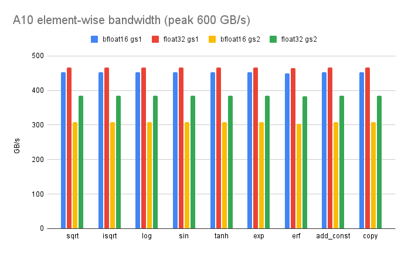

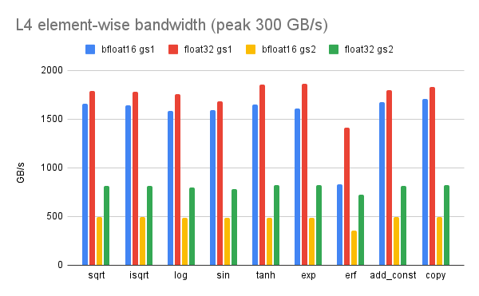

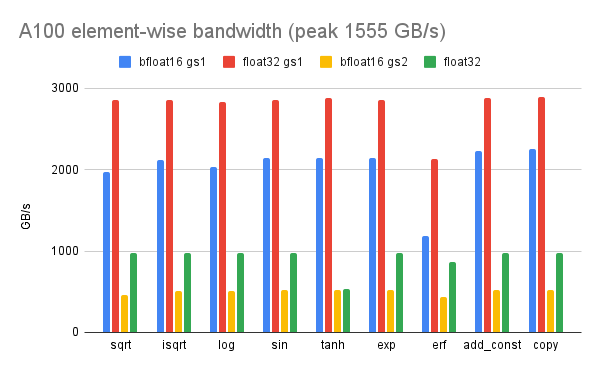

### From `bench_elementwise_memcopy.mojo`

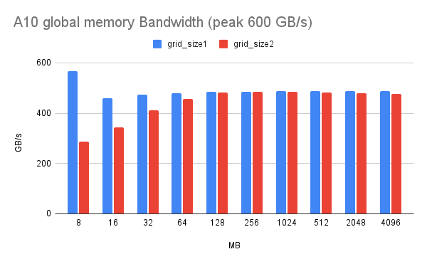

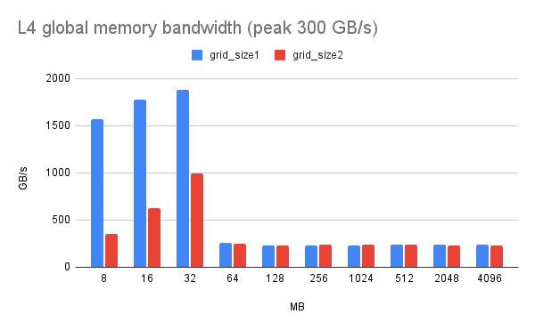

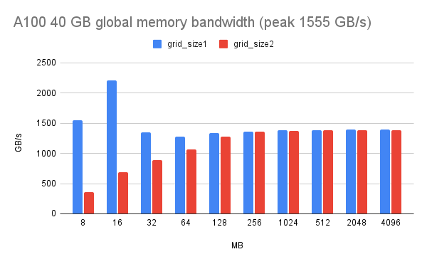

- There does not seem to be a single case where grid_size2 has an advantage.
- For very large sizes it appears to mostly reach parity with grid_size1 but at
  even larger sizes seems to be inferior. I first noticed this with my CUDA
  memcopy code for large sizes.

Based on this we should only use `grid_size1` for elementwise in Mojo.

Vectorization

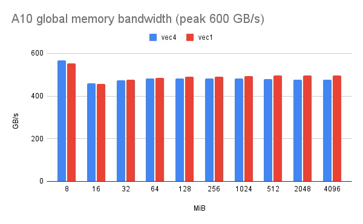

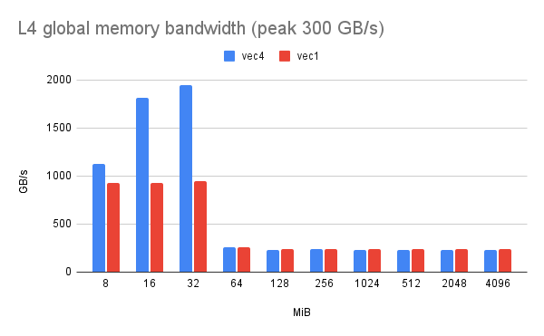

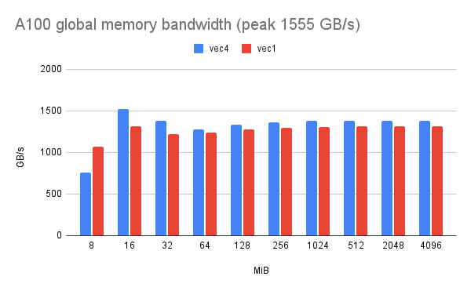

- In the global memory region vec4 only seems to help on the A100.
- Vec4 seems to help in L2.

It’s difficult to conclude what vectorization to use with `element-wise` to
benchmarking without cache-busting. It looks like on the A100 we want `vec4` in
general. But on the A10 and L4 it may be worse for IO from global memory.

With `bfloat16` there are `vec2` arithmetic instructions. But not many with
these GPUs (`fma` and maybe `log2`). Not until Hopper (sm_90). It’s not clear
this matters though in the global memory region.

---

## `memcpy` in depth

### Hardware details

Ampere sm_80 SM (A100)

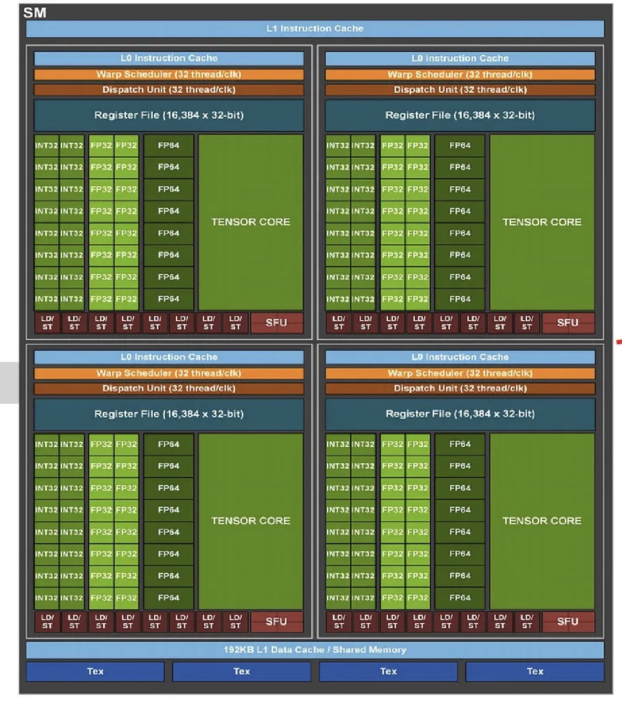

Ada Lovelace sm_89 SM (L4 and RTX 4060 laptop)

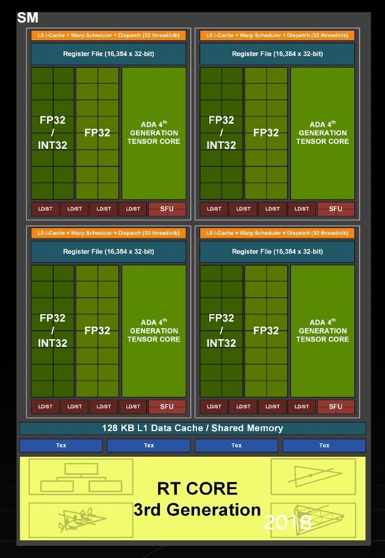

|  | SMs | LD/ST per SM | Boost clock | Max bytes per cycle | GB/s per SM | Peak global memory GB /s |
| --- | --- | --- | --- | --- | --- | --- |
| A100 40 GB | 108 | 32 | 1410 MHz | 138234 = 4*32*108 | 180.5 | 1555 |
| A10 | 80 | 32 | 1695 MHz | 10240 = 4*32*80 | 216.96 | 600 |
| L4 | 56 | 16 | 2040 MHz | 3584  = 4*16*56 | 130.56 | 300 |

GB/s second assumes load/stores every clock cycle from L1.  But in practice a
memcpy function will require several instructions per iteration.

Bandwidth 1 SM

|  | vec1 | vec2 | vec4 | vec4/peak per SM |
| --- | --- | --- | --- | --- |
| A100 | 14.9 GB/s | 26.3 GB/s | 51.5 GB/s | 28% = 51.5/180.5 |
| A10 | 22.0 GB/s | 41.9 GB/s | 73.7 GB/s | 33% = 73.7/216.96 |
| L4 | 22.8 GB/s | 43.5 GB/s | 78.2 GB/s | 60% = 78.2/130.56 |

The L4 (Ada Lovelace sm_89) SM has half the number of load store units of the
A100 and A10 SM. But this is not reflected in the performance for a single SM.

Memcpy on the server CPUs also requires many cores (like SMs) and
vectorizaztion.

More details on this Stack Overflow thread, ["memory bandwidth for many
channels x86
systems"](https://stackoverflow.com/questions/56803987/memory-bandwidth-for-many-channels-x86-systems)

---

## Instructions per iteration

SASS of `memcpy` from CUDA C++ code using 32-bit iterators

```cpp
__global__ void device_copy_scalar_kernel(int *d_in, int *d_out, unsigned n) {
  unsigned idx = blockIdx.x * blockDim.x + threadIdx.x;
  for (unsigned i = idx; i < n; i += blockDim.x * gridDim.x) d_out[i] = d_in[i];
}
```

```asm
/*0070*/
HFMA2.MMA R5, -RZ, RZ, 0, 2.3841e-07    // R5 = 4 ?
IMAD.WIDE R2, R0, R5, c[0x0][0x160]     // R2 = R0*R5 + c[0x0][0x160] = 4*i + d_in
LDG.E R3, [R2.64]                       // R3 = d_in[i]
IMAD.WIDE R4, R0, R5, c[0x0][0x168]     // R4 = R0*R5 + c[0x0][0x168] = 4*i + d_out
MOV R7, c[0x0][0x0]                     // R7 = gridDim.x
IMAD R0, R7, c[0x0][0xc], R0            // R0 += c[0x0][0x0]*c[0x0][0xc] // i += gridDim.x*threadIdx.x
ISETP.GE.AND P0, PT, R0, c[0x0][0x170], PT // P0 = R0 >= n
STG.E [R4.64], R3                       // d_out[i] = R3
@!P0 BRA 0x70                           // goto 0x70 if P0
```

Each iterations reads 4 bytes and stores 4 bytes

Vec4

```mojo
__global__ void device_copy_vector4_kernel(int *d_in, int *d_out, unsigned n) {
  unsigned idx = blockIdx.x * blockDim.x + threadIdx.x;
  for (unsigned i = idx; i < n / 4; i += blockDim.x * gridDim.x) {
    reinterpret_cast<int4 *>(d_out)[i] = reinterpret_cast<int4 *>(d_in)[i];
  }
}

```

Here is the SASS

```asm
/*0070*/
HFMA2.MMA R3, -RZ, RZ, 0, 9.5367e-07    // R3 = 16 ?
IMAD.WIDE R4, R0, R3, c[0x0][0x160]
LDG.E.128 R4, [R4.64]                   // 128-bit load
IMAD.WIDE R2, R0, R3, c[0x0][0x168]
MOV R9, c[0x0][0x0]
IMAD R0, R9, c[0x0][0xc], R0
ISETP.GE.AND P0, PT, R0, 0xd693a40
STG.E.128 [R2.64], R4                   // 128-bit load
@!P0 BRA 0x70
```

Each iteration reads 16 bytes and stores 16 bytes.

Notice that the only difference between the two loops is Vec4 uses 128 bit
loads and the factor is 16 instead of 4. Both loops take 9 instructions.  The
vec4 is effectively amortizing the cost of the pointer arithmetic by four.

|  | bytes/iteration |
| --- | --- |
| vec1 | 8 |
| vec2 | 16 |
| vec4 | 32 |

With 64-bit iterators the code is a bit longer

```mojo
__global__ void device_copy_scalar_kernel(int *d_in, int *d_out, size_t n) {
  size_t idx = blockIdx.x * blockDim.x + threadIdx.x;
  for (size_t i = idx; i < n; i += blockDim.x * gridDim.x) d_out[i] = d_in[i];
}

```

The only difference from the 32-bit iterator version is the use of `size_t`.
Here is the SASS

```asm
IMAD.SHL.U32 R4, R0.reuse, 0x4, RZ                              //
SHF.L.U64.HI R5, R0, 0x2, R7
IADD3 R2, P0, R4, c[0x0][0x160]                                 // R2 = in ptr low
IADD3.X R3, R5, c[0x0][0x164], RZ, P0, !PT                      // R3 = in ptr high
LDG.E R3, [R2.64]                                               // load from R2, R3
IADD3 R4, P0, R4, c[0x0][0x168], RZ                             // R4 = out ptr low
IMAD R9, R6, c[0x0][0xc], RZ                                    // R9 = R6*c[0x0][0xc] + 0
IADD3.X R5, R5, c[0x0][0x16c], RZ, P0, !PT                      // R5 = out ptr high
IADD3 R0, P0, R9, R0, RZ                                        // R0 += 1
IMAD.X R7, RZ, RZ, R7, P0                                       // R7 += carry
ISETP.GE.U32.AND P0, PT, R0, c[0x0][0x170], PT                  // P0 = i_low < n_low
ISETP.GE.U32.AND.EX P0, PT, R7, c[0x0][0x174], PT, P0           // P0 &= i_high < n_high
STG.E [R4.64], R3                                               // store from R4, R5
@!P0 BRA 0xa0                                                   // goto 0xa0 if i < n
```

It needs 14 instructions or 5 more than the 32-bit iterator version.

- 2 instructions: the pointer arithmetic requires one extra instruction to add
  the upper 32-bits (two pointers)

    The `.X` in `IADD3.X R3, R5, c[0x0][0x164], RZ, P0, !PT` and  `IADD3.X R5,
    R5, c[0x0][0x16c], RZ, P0, !PT` means add the carry.

- 1 instruction: The conditional needs to compare the high 32-bits of the
  64-bit `n`.

    `IMAD.X R7, RZ, RZ, R7, P0`

- 1 instruction: The iterator needs to add the carry to the high 32-bits of the
  64-bit iterator `ISETP.GE.U32.AND.EX P0, PT, R7, c[0x0][0x174], PT, P0`.

What about Mojo?

```mojo
fn copy[simd_size: Int, align: Int](
    a_ptr: UnsafePointer[Scalar[dtype]],
    b_ptr: UnsafePointer[Scalar[dtype]],
    n: Int,
):
    var idx = ThreadIdx.x() + BlockDim.x() * BlockIdx.x()
    var a = Buffer[dtype](a_ptr, n)
    var b = Buffer[dtype](b_ptr, n)
    for i in range(idx, n//simd_size, BlockDim.x()*GridDim.x()):
        b.store[alignment=align](
            i*simd_size,
            a.load[width=simd_size, alignment=align](i*simd_size),
        )
```

Here is the Mojo SASS.

```asm
/*02c0*/
IADD3 R4, P0, R13, c[0x0][0x160], RZ ;                  // in low   R4 = P0*R13 + c[0x0][0x160] ?
IADD3.X R5, R14, c[0x0][0x164], RZ, P0, !PT ;           // in high
LDG.E.128 R4, [R4.64] ;                                 // load 128-bit
ISETP.GT.U32.AND P0, PT, R8, R15, PT ;
IADD3 R10, P1, R13, c[0x0][0x168], RZ ;                 // out low
ISETP.GT.U32.AND.EX P0, PT, R0, R17, PT, P0 ;
IADD3.X R11, R14, c[0x0][0x16c], RZ, P1, !PT ;          // out high
SEL R9, R8, R15, P0 ;                                   // R9  = PO ? R8 : R15
SEL R12, R0, R17, P0 ;                                  // R12 = P0 ? R0 : R17
IADD3 R9, P1, -R15, R9, RZ ;
IADD3 R15, P2, R2, R15, RZ ;
ISETP.GT.U32.AND P0, PT, R9, RZ, PT ;
IMAD.X R9, R12, 0x1, ~R17.reuse, P1 ;
LEA R13, P1, R2, R13, 0x4 ;                             // i low
IMAD.X R17, R3, 0x1, R17, P2 ;
ISETP.GT.AND.EX P0, PT, R9, RZ, PT, P0 ;                // i < n ?
IMAD.X R14, R14, 0x1, R19, P1 ;                         // i high
STG.E.128 [R10.64], R4 ;                                // store 128-bit
@P0 BRA 0x2c0 ;
```

This Mojo function needs 19 instructions per iteration of the `memcpy`. Whereas
the CUDA version with 64-bit iterators needed 14 instructions.

We have not worked through all the details of the undocumented SASS. But the
pointer arithmetic makes sense mostly. The pointers are 64-bits.

`c[0x0][0x160]` and `c[0x0][0x164]` must store the low and high values of the
base input pointer

 `R13` and `R14` I assume are the high and low value of the iterator. The load
 actually uses two registers `R4` and `R5` .

```asm
IADD3 R4, P0, R13, c[0x0][0x160], RZ ;                  // in low   R4 = P0*R13 + c[0x0][0x160] ?
IADD3.X R5, R14, c[0x0][0x164], RZ, P0, !PT ;           // in high
LDG.E.128 R4, [R4.64] ;                                 // load 128-bit
```

Where `IADD3.X` means add with the carry value in `P0`.

The pointer arithmetic for the output pointer is similar using `R10` and `R11`
for high and low and

`c[0x0][0x168]` and `c[0x0][0x168]` must be the low and high 32-bits of the
base output pointer.

```asm
IADD3 R10, P1, R13, c[0x0][0x168], RZ ;                 // out low
IADD3.X R11, R14, c[0x0][0x16c], RZ, P1, !PT ;          // out high
STG.E.128 [R10.64], R4
```

The iterator is also 64-bits

```asm
LEA R13, P1, R2, R13, 0x4 ;                             // i low
IMAD.X R14, R14, 0x1, R19, P1 ;                         // i high
```

The conditional is also 64-bits

```asm
ISETP.GT.U32.AND P0, PT, R8, R15, PT ;
ISETP.GT.U32.AND.EX P0, PT, R0, R17, PT, P0 ;
SEL R9, R8, R15, P0 ;                                   // R9  = PO ? R8 : R15
SEL R12, R0, R17, P0 ;                                  // R12 = P0 ? R0 : R17

ISETP.GT.U32.AND P0, PT, R9, RZ, PT ;
ISETP.GT.AND.EX P0, PT, R9, RZ, PT, P0 ;
```

Based on the CUDA code the SASS would be a lot simpler if the iterator and max
value were 32-bit instead of 64-bits.

---

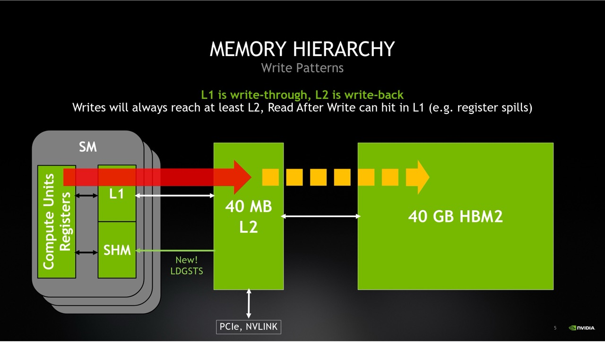

and

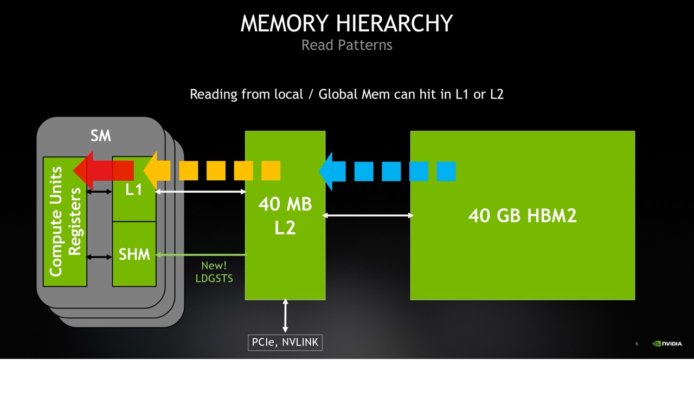

---

## Update with cache busting in Bencher


Observations:

- bfloat16 is a bit faster than float32 on the L4 but a bit slower than float32
  on the A100 and A10.
- On the A100 bfloat16 is slower than float32.
- On the A100 the bandwidth is lower than 60% of peak for 8 MiB but almost 85%
  for 2 GiB.
