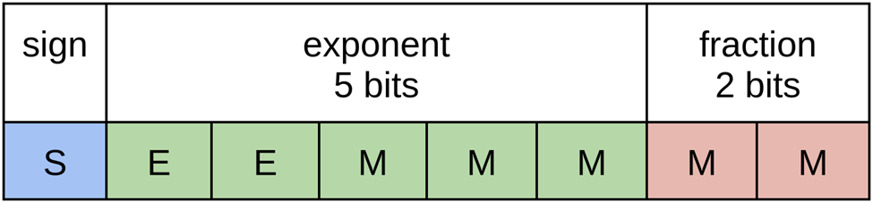
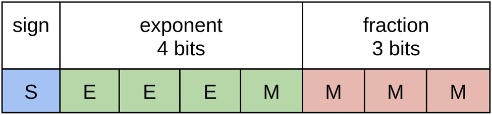
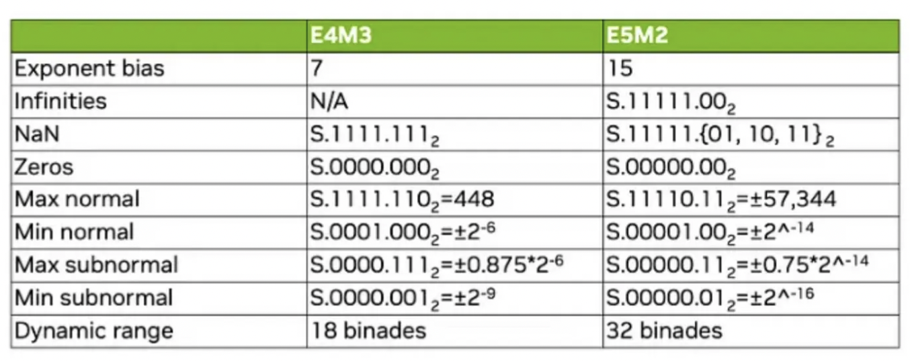

- **Author:** Abdul Dakkak
- **Date:** January 16, 2025

FP8 is an 8-bit floating point standard developed jointly by NVIDIA, ARM, and
Intel to accelerate AI development by improving memory efficiency and reducing
computational overhead. This document expands on what that means from both a
product and a development perspective.

By better utilizing FP8 support on H100 and other accelerators, we can
theoretically double the performance of model execution without massive impact
on accuracy. By decreasing the resident weight size, we can enable fitting a
70B model on an 80GB GPU. This work will also sets the stage for W4A8 and W8A8
quantization schemes.

## Introduction

FP8 uses half the bits compared to FP16 (half-precision floating point),
leading to a significant reduction in memory requirements for storing model
weights and activations. This is particularly crucial for large models and long
sequence lengths, where memory constraints can be a major bottleneck. And, when
used with the Transformer Engine and large matrix sizes, can achieve almost
twice the throughput of FP16 on Hopper and Ada Lovelace GPUs. In terms of
features, FP8 provides:

- **8-Bit Format**: FP8 uses only 8 bits to represent floating-point numbers,
  which significantly reduces the memory footprint compared to traditional
  16-bit or 32-bit formats.
- **Higher Dynamic Range**: Compared to INT8, FP8 offers a higher dynamic
  range, making it more suitable for quantizing large language models (LLMs)
  and other neural network models that require more precision.
- **Standardization Effort**: The format is part of a standardization effort to
  create a common interchange format for AI, facilitating better
  interoperability between different hardware and software platforms.

## Formats

The designated use of FP8 encodings within the context of deep learning and
neural networks is as follows: E4M3 is specifically intended for weight and
activation tensors, while E5M2 is designated for gradient tensors. This
distinction arises from the inherent characteristics of each tensor type and
the specific computational demands they place on the system.

Weight and activation tensors typically require a balance between numerical
range and precision. E4M3, with its 4 exponent bits and 3 mantissa bits,
provides this balance, allowing for a reasonable range of values while
maintaining sufficient precision for accurate computations during forward and
backward propagation.

On the other hand, gradient tensors often exhibit a wider dynamic range due to
the accumulation of small values during backpropagation. E5M2, with its 5
exponent bits and 2 mantissa bits, prioritizes representing a larger range of
values, even if it means sacrificing some precision. This is often acceptable
for gradients, as their primary role is to indicate the direction of change,
    rather than the exact magnitude.

### F8E5M2

F8E5M2 is a specific 8-bit floating-point format designed for situations where
memory and computational efficiency are crucial, often seen in AI and machine
learning applications on resource-constrained devices.

Here's a breakdown of what it represents:

- **F8:** Denotes an 8-bit floating-point format.
- **E5:** 5 bits are allocated to the exponent, impacting the range of numbers
  that can be represented.
- **M2:** 2 bits are assigned to the mantissa, influencing the precision or
  level of detail in the numbers.
- **Sign:** The remaining bit is dedicated to the sign (positive or negative).

In essence, F8E5M2 prioritizes a wider range of representable numbers (due to
the 5 exponent bits) over higher precision (only 2 mantissa bits). This
trade-off makes it suitable for applications where capturing a broader range of
values is more important than extreme accuracy.

### F8E4M3

"F8E4M3 format" is a specific way to store numbers using 8 bits, making it
compact for memory and faster to process. The "F8" indicates it's an 8-bit
floating-point format, similar to the FP8 you asked about earlier. The "E4M3"
part specifies how those 8 bits are divided: 4 bits for the exponent (the "E"
part) and 3 bits for the mantissa (the "M" part), with the remaining bit for
the sign.

This particular format strikes a balance between representing a decent range of
numbers (due to the 4 exponent bits) and maintaining some level of precision
(with the 3 mantissa bits). It's often used in situations where memory and
computational efficiency are crucial, like machine learning applications on
devices with limited resources.

## Plumbing

We have experience plumbing a new DType across our stack (we’ve done it for
FP16 and BF16). This is mostly mechanical and straight forward. Note that while
we are at it we are going to add support for all of
[Float8E5M2](https://docs.nvidia.com/cuda/cuda-math-api/struct____nv__fp8__e5m2.html#struct____nv__fp8__e5m2),
[Float8E4M3](https://docs.nvidia.com/cuda/cuda-math-api/struct____nv__fp8__e4m3.html#struct____nv__fp8__e4m3),
and Float8E3M4 but we won’t support Float8E3M4 since that’s not supported by
NVIDIA hardware.

We started this process by adding support for both
[Float8E5M2](https://docs.nvidia.com/cuda/cuda-math-api/struct____nv__fp8__e5m2.html#struct____nv__fp8__e5m2)
and
[Float8E4M3](https://docs.nvidia.com/cuda/cuda-math-api/struct____nv__fp8__e4m3.html#struct____nv__fp8__e4m3)
to enable us to plumb this functionality into Mojo kernels.

### Mojo

The Mojo stack requires one to implement the following specification:

/// caption
Cross reference: [OpenVINO
Toolkit](https://github.com/pavel-esir/openvino/blob/c0d02e9188e3fc40a28a0552890b3e0fe01f687a/src/core/src/type/float8_e4m3.cpp#L54)
///

## References

- [FP8 Formats for Deep Learning](https://arxiv.org/abs/2209.05433)
- [Nvidia on Demand: FP8 for Deep Learning](https://www.nvidia.com/en-us/on-demand/session/gtcspring23-s52166/)
- [FP8 LLMs for vLLM](https://huggingface.co/collections/neuralmagic/fp8-llms-for-vllm-666742ed2b78b7ac8df13127)
- [Neural Magic AutoFP8](https://github.com/neuralmagic/autofp8)
- [Nvidia TensorRT-Model-Optimizer](https://github.com/NVIDIA/TensorRT-Model-Optimizer)
- [Nvidia TensorRT-Model-Optimizer Quantization](https://nvidia.github.io/TensorRT-Model-Optimizer/guides/1_quantization.html)
- [cftal](https://github.com/axze-az/cftal)
- [Table-lookup algorithms for elementary functions and their error analysis](https://ieeexplore.ieee.org/document/145565)
- [RLIBM: Rutgers Architecture and Programming Languages Lab's Correctly Rounded Libm](https://people.cs.rutgers.edu/~sn349/rlibm/)
- [SLEEF - SIMD Library for Evaluating Elementary Functions](https://github.com/shibatch/sleef)
- [Kernel Float](https://github.com/KernelTuner/kernel_float)
- [CUDA FP16x2 approximate math library](https://github.com/minhhn2910/fp16-fast-math)
- [swAFL: A Library of High-Performance Activation Function for the Sunway Architecture](https://www.mdpi.com/2079-9292/11/19/3141)
- [RTP-LLM](https://github.com/alibaba/rtp-llm/)
- [Scaling FP8 training to trillion-token LLMs](https://arxiv.org/abs/2409.12517)
- [Partial Taxonomy of 8-bit Floating-Point Formats](https://fprox.substack.com/p/partial-taxonomy-of-8-bit-floating)
- [FP8 data type - all values in a table](https://asawicki.info/articles/fp8_tables.php)
