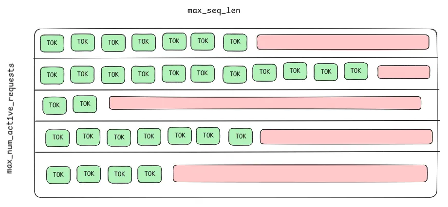
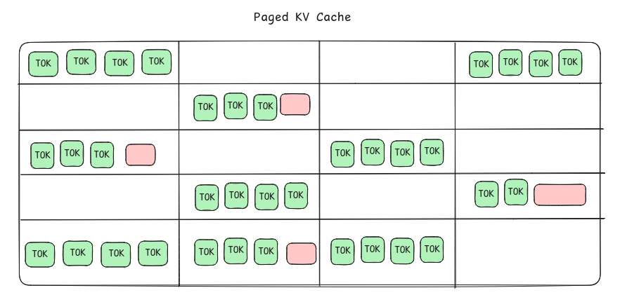
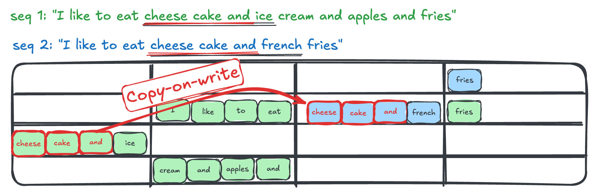
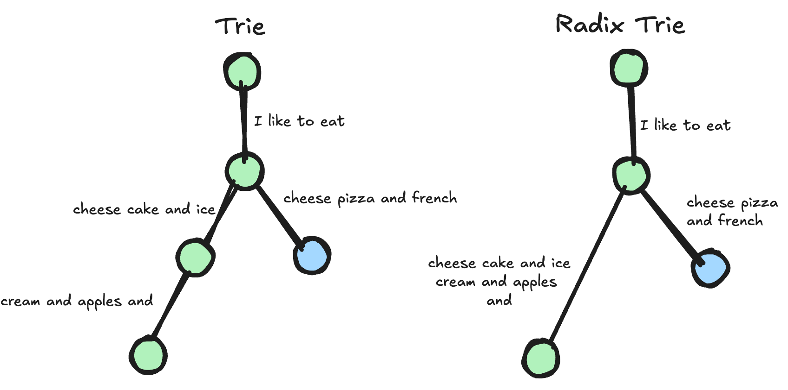
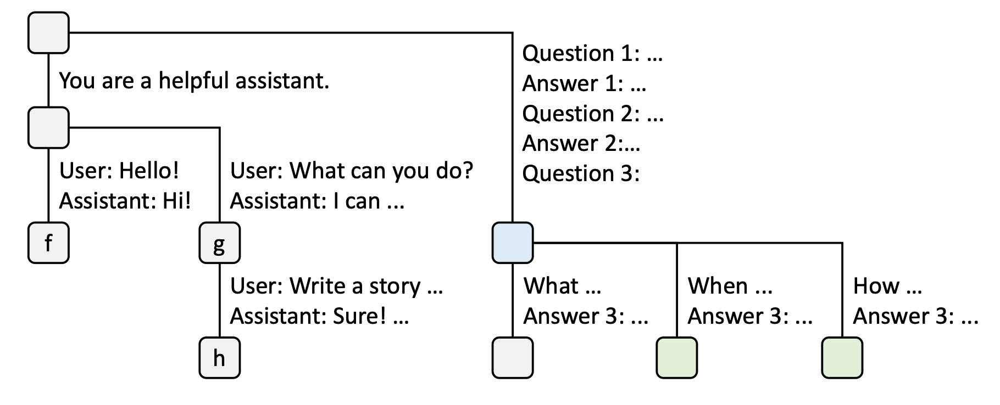
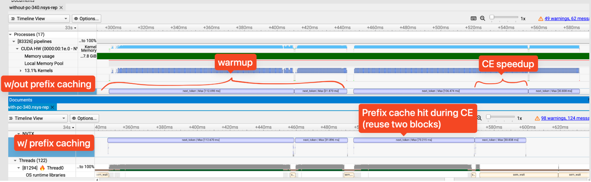
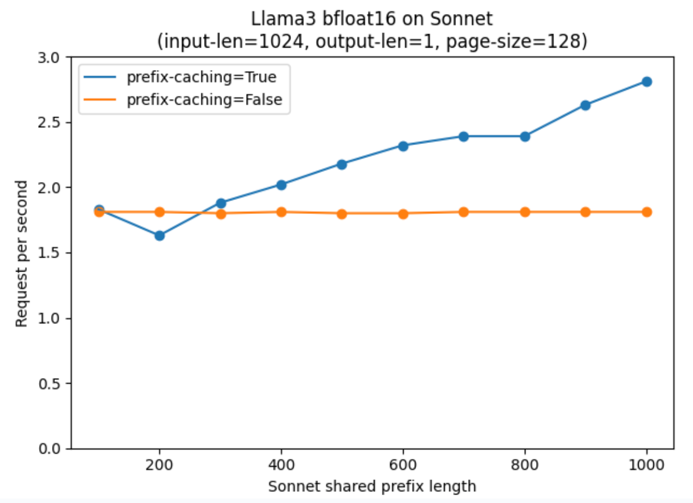
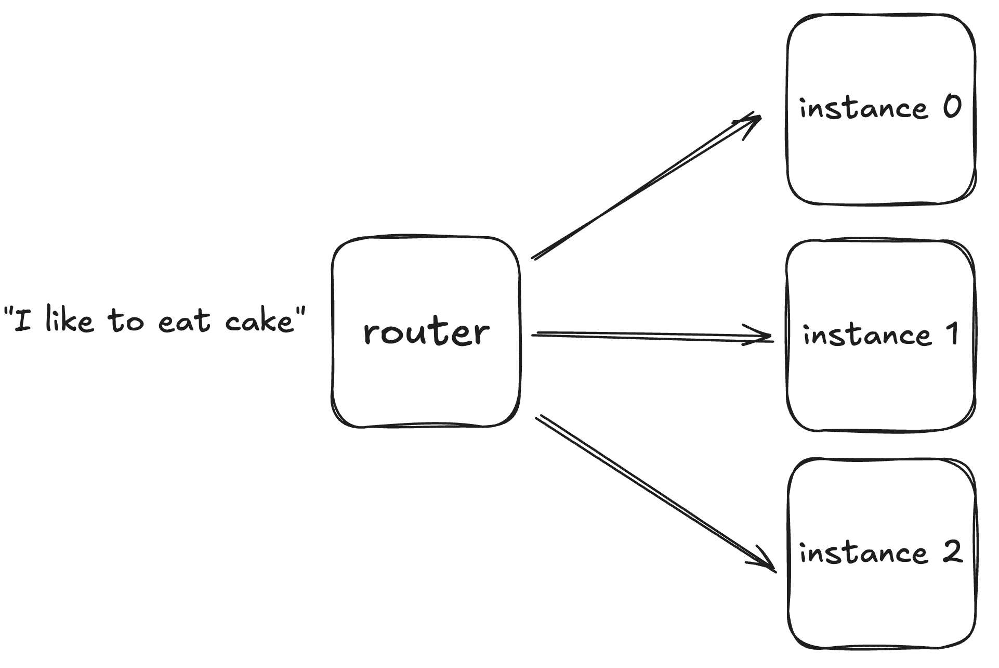
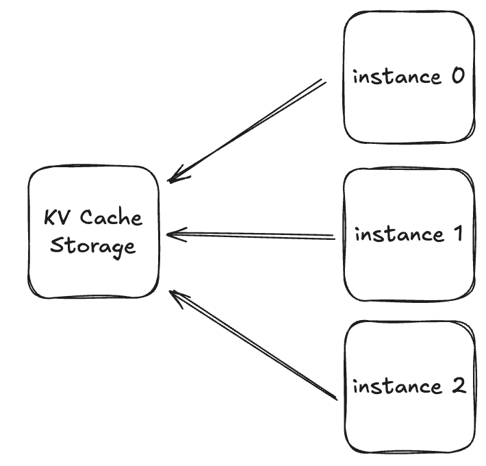

- **Authors:** Austin Doolittle and Brian Zhang
- **Date:** January 30, 2025

## Introduction

KV Caching is an essential component of an optimal LLM inference solution, as
it enables memoization of previous Key and Value projections for each
transformer layer such that we avoid re-computing these projections during each
invocation of the model during autoregressive generation.

A naive way to manage this KVCache is to pre-allocate a chunk of memory up to
the `max_seq_len` supported by the model and assign it to each active sequence
being generated, however this can lead to inefficient use of memory.


/// caption
An example of memory inefficiency in a KVCache.
///

The above shows a KVCache where each sequence along the vertical axis is
allocated enough memory to store max_seq_len tokens on the horizontal axis. The
green pictured tokens are actively used memory containing KV projections for
each sequence, the red portions are areas of unused memory that is unavailable
for other sequences to use for their Key and Value projections.

PagedAttention is an approach invented by the creators of vLLM which borrows
from virtual memory concepts in operating systems. The approach fragments the
memory backing the KVCache into pages and strings together multiples of these
fragments into logically contiguous buffers. This approach brings other
benefits, like the ability to oversubscribe the memory allocated for the
KVCache to maintain more active sequence generation tasks and the ability for
sequences to share Key and Value projections if they have the same prompt
prefix.

This doc will describe PagedAttention in more detail,and outline how we’ve
added support for PagedAttention in our codebase.

### Resources

- [Efficient Memory Management or Large Language Model Serving with
  PagedAttention](https://arxiv.org/abs/2309.06180)
- [vLLM and PagedAttention: A Comprehensive
  Overview](https://medium.com/@abonia/vllm-and-pagedattention-a-comprehensive-overview-20046d8d0c61)

## What is Paged Attention?

, Figure
6](img/genai-paged-attention/img02.png)
/// caption
Block table translation in vLLM. Source: [Kwon, et.
al.](https://arxiv.org/pdf/2309.06180), Figure 6
///

As mentioned previously, PagedAttention borrows from virtual memory concepts in
modern operating systems. The KVCache is physically allocated as a region of
pages containing a fixed number of tokens, called the `page_size`. In the above
example, this physical allocation is on the right hand side and has a
`page_size` of 4 tokens. The kernel is presented with a logical view of the
KVCache via a block table which maps logical token indices to physical
locations in device memory. As new tokens are generated, new Key and Value
cache projections are written into the physical pages, and as we fill pages,
our KVCache Manager will assign more unused pages for the sequence to continue
filling in.

With this fragmentation, we can take the example provided in the introduction
and show how this approach can free up memory for other sequences to leverage
for their KVCache.



One trade-off this solution comes with is slower kernel latency. We are adding
an additional call to device memory into the lookup table before a subsequent
call to device memory to retrieve values for the given page. Memory bandwidth
is generally a bottleneck, and inserting more calls to memory in our kernel has
been measured slowing down MHA kernel execution by up to 13% (source: [Prabhu,
et. al.](https://arxiv.org/pdf/2405.04437), section 3.3.1). This latency hit is
generally compensated by the other benefits that PagedAttention unlocks.

### How have we implemented Paged Attention?

The MAX Framework implementation of PagedAttention relies on our existing use
of `mo.opaque` to represent the KVCache. We’ve added a new `PagedKVCache`
abstraction which adheres to the same interfaces as our existing
`ContiguousKVCache` and `ContinuousBatchingKVCache` implementations, which
enables each KVCache implementation to leverage the same MHA and Matmul kernel
implementations.

The `PagedKVCache` implementation includes a pointer to the buffer containing
all KVCache pages, and a page table which is responsible for translating
logical token indices into physical locations in device memory. The code here
is simplified for demonstration purposes, for a deeper dive check it out in the
[Modular GitHub
repository.](https://github.com/modular/modular/blob/main/max/kernels/src/kv_cache/types.mojo#L359)

#### PagedKVCache Code

```mojo
struct PagedKVCache[
    type_: DType,
    kv_params_: KVCacheStaticParams,
    page_size: Int,
](KVCacheT):

    """blocks has shape: [total_num_pages, num_layers, 2, page_size, num_heads, head_size]"""
    var blocks: NDBuffer[Self.type, 6]

    """lookup_table has shape [batch_size, ceildiv(longest_seq_len, page_size)]"""
    var lookup_table: NDBuffer[DType.uint32, 2]

    @always_inline
    fn _get_idx(
        self, bs: Int, head_idx: Int, tok_idx: Int, head_dim_idx: Int
    ) -> IndexList[6]:

        lut_block_index, tok_in_block_idx = divmod(tok_idx, self.page_size)
        block_idx = Int(self.lookup_table[bs, lut_block_index])
        return IndexList[6](
            self.layer_idx,
            self.kv_idx,
            block_idx,
            tok_in_block_idx,
            head_idx,
            head_dim_idx,
        )

    fn load[
        width: Int
    ](self, bs: Int, head_idx: Int, tok_idx: Int, head_dim_idx: Int) -> SIMD[
        Self.type, width
    ]:
        var idx = self._get_idx(bs, head_idx, tok_idx, head_dim_idx)
        return self.blocks.load[width=width](idx)

    fn store(
        self,
        bs: Int,
        head_idx: Int,
        tok_idx: Int,
        head_dim_idx: Int,
        val: SIMD[Self.type, *_],
    ):
        var idx = self._get_idx(bs, head_idx, tok_idx, head_dim_idx)
        self.blocks.store(idx, val)

```

Our kernels can then be parameterized on the KVCacheT trait and implemented in
a generic fashion ([Code
Link](https://github.com/modular/modular/blob/e6523da9579e3daa048870145680bb37b3bb2c0d/max/kernels/src/nn/kv_cache.mojo#L159)):

#### Kernel Code Example

```mojo
@always_inline
fn _fused_qkv_matmul_kv_cache_impl[
    ...
    collection_t: KVCollectionT,
    ...
](
    hidden_state: NDBuffer[type, 3, hidden_state_shape],
    weight: NDBuffer[type, 2, weight_shape],
    kv_collection: collection_t,
    layer_idx: UInt32,
    output: NDBuffer[type, 3, output_shape],
    context: Optional[DeviceContext],
) raises:

    alias kv_params = cache_t.kv_params
    alias N = weight_shape.get[0]()
    alias K = weight_shape.get[1]()

    var SEQ_LEN: UInt = hidden_state.dim[1]()

    var q_dim = output.dim[2]()
    var k_dim = kv_params.head_size * kv_params.num_heads
    var qk_offset = q_dim + k_dim

        # k and v_cache are implementations of KVCacheT
    var k_cache = kv_collection.get_key_cache(Int(layer_idx))
    var v_cache = kv_collection.get_value_cache(Int(layer_idx))

    @parameter
    @__copy_capture(q_dim, qk_offset, SEQ_LEN, k_cache, v_cache)
    fn write_to_cache[
        type_: DType, width: Int, *, alignment: Int = 1
    ](idx: IndexList[2], val: SIMD[type_, width],):
        b_idx, t_idx = divmod(UInt(idx[0]), SEQ_LEN)
        if idx[1] < q_dim:
            output.store[width=width, alignment=alignment](
                Index(Int(b_idx), Int(t_idx), idx[1]),
                rebind[SIMD[type, width]](val),
            )
            return

        var h_idx: UInt
        var hd_idx: UInt
        var cache: cache_t
        var output_val = val
        if idx[1] < qk_offset:
            cache = k_cache
            h_idx, hd_idx = divmod(UInt(idx[1]) - q_dim, kv_params.head_size)

        else:
            cache = v_cache
            h_idx, hd_idx = divmod(
                UInt(idx[1]) - qk_offset, kv_params.head_size
            )

        var valid_len = cache.cache_length(b_idx)
        var cache_t_idx = t_idx + valid_len
        cache.store(
            b_idx,
            h_idx,
            cache_t_idx,
            hd_idx,
            rebind[SIMD[cache_type, width]](output_val),
        )

    _matmul_common[target=target, elementwise_lambda_fn=write_to_cache](
        hidden_state, weight, context
    )
```

We’ve also implemented a new `PagedKVCacheManager` class which is responsible
for keeping records of which KVCache pages contain projections for which
    sequences of tokens. When we call `next_token` in the `TokenGenerator`,
    this new manager will check the tokens in incoming sequences and assign
    pages to write new projections into. This logic is a bit harder to boil
    down to pseudocode, but you can check the actual implementation out here
    [Code
    Link](https://github.com/modular/modular/blob/e6523da9579e3daa048870145680bb37b3bb2c0d/max/nn/kv_cache/paged_cache/paged_cache.py#L166).

Our new `PagedKVCacheManager` also implements other optimizations that
PagedAttention unlocks, which includes prefix caching and eviction. We’ll
discuss those features in more depth in the next section.

## What is Prefix Caching?

Prefix Caching enables more efficient usage of the
PagedAttention KVCache by allowing reuse and sharing of KV projections between
different sequences when these sequences share a common prefix.


///caption
Paged attention without prefix caching
///

In the above diagram, we show the layout of a PagedAttention KVCache without
prefix sharing for two sequences when the `page_size` (a.k.a. `block_size`) is
4 tokens. As the two sequences share a common prefix, the contents of their
first page is identical. Both `seq 1` and `seq 2`’s first page stores KV
projections for the tokens “I like to eat”. However, it is a waste to have two
pages containing the same data.


///caption
Paged attention with prefix caching
///

Through prefix caching, we can eliminate this extra page. When `seq 2`
initiates context encoding, it can first query the prefix cache and determine
whether it actually needs to allocate a new page or there already is one it can
reuse. In this example, `seq 2` can use the existing page created by `seq 1`
for its first 4 tokens.

### How does this help?

Prefix caching yields two main benefits:

- **Storage**: We reduce storage usage in the KVCache by allowing pages to be
  shared. This allows us to make better use of our cache and potentially
  schedule larger batches. Large batches can yield improved throughput.
- **Speed**: By having seq 2 read the existing KV projections instead of
  re-computing them, we reduce the work for the kernels during the context
  encoding (CE) step of seq 2. This speedup in CE allows us to improve our
  bottom line metric of TTFT (time to first token).

](img/genai-paged-attention/img06-cache-hit-rate-sglang.png)
///caption
Cache hit rate ablation study, Source: [Zheng, et.
al.](https://arxiv.org/pdf/2312.07104), Figure 8a,b
///

The above is the ablation study from SGLang, a LLM inference library similar to
vLLM. SGLang is the first paper to propose automatic prefix caching and rivals
vLLM in performance.

In this chart, the cache hit rate is the percentage of prompt tokens that reuse
pages from the KVCache through prefix caching. “It shows that a higher cache
hit rate leads to a larger batch size, higher throughput, and lower latency.”
We see that when the cache hit is 100% (i.e: all prompts are identical),
enabling prefix caching increases throughput 3x from ~400 to ~1200 tokens/s.

However, the throughput speedup may be less pronounced if the workload is
decode heavy as most of the time is spent in token generation, and prefix
caching does not speedup token gen.

This optimizations is useful in many common scenarios:

- A LLM service that has a common system prompt.
- For advanced decoding algorithms like beam search.
- “Long document query, where the user repeatedly queries the same long
  document (e.g. software manual or annual report) with different queries”
  (Source: [vLLM: "What is automatic prefix
  caching](https://docs.vllm.ai/en/v0.6.4/automatic_prefix_caching/apc.html)).
- Multi-round conversations: we do not have to re-encode the history of the
  conversation each time and can read it from cache.

#### Common gotchas

This caching approach differs from typical caches you may have seen:

**Typical caches:** `K -> V`

- Redis cache can map a document name to a single document file

**PagedAttention KVCache:** `T_0, T_1, T_2, ..., T_n -> KV_0, KV_1, KV_2, ...,
KV_n`  where `KV_i = KvProjection(T_0, T_1, T_2, ..., T_i)`

- PagedAttention KVCache maps each token in a sequence to its KV projection
  which is dependent on all preceding tokens.
- The KV projection may be represented as the index + offset into a page

This dependence of the KV projection on all proceeding tokens can be a bit
confusing so here is an example. The earlier two sequences would have a
different KV projection for the token *“fries”* even though it is the same
token. This is because the tokens prior to *“fries”* differ.

- seq 1: *“I like to eat cheese cake and … and fries”*
- seq 2: *“I like to eat cheese pizza and … french fries”*


///caption
This diagram can be misleading as the pages containing the token “fries” appear
to be the same. However, they cannot be de-duplicated into one page.
///

### Page size granularity and copy-on-write optimization

Some of you may have noticed that the sequences presented earlier share a
longer common prefix than just *“I like to eat”*. The entire common prefix is
*“I like to eat cheese cake and”*.

The reason we truncated the common prefix when applying the prefix caching
optimization is due to the page size granularity of the PageAttention KVCache.
In this case `page_size = 4 tokens`, and the entire common prefix spans 4
tokens of the first block and 3 tokens of the second block.

- *“I like to eat    /   cheese cake and {ice, french}”.*

Because the prefix cache operates on whole pages, we align the matched tokens
along page size boundaries.

This larger granularity is currently due to a limitation of MAX’s attention
kernels. Our kernels assume that the page size is a multiple of the kernel tile
size which is 128 tokens. For example, 128, 256, 384, 512, … are valid page
sizes. There is work now towards supporting a wider range of page sizes
(E2EOPT-28).

The reason we have a coarse granularity is for performance. The original vLLM
paper found that a larger page size granularity of between 16 - 128 tokens is
needed for good performance on their benchmarks.

, Figure
18b](img/genai-paged-attention/img08-end-to-end-latency-block-sizes.png)
///caption
End-to-end latency with different block sizes. Source: [Kwon, et.
el.](https://arxiv.org/abs/2309.06180), Figure 18b
///

However, SGLang claims that a page size/block_size = 1 token achieves the “same
performance as the larger block sizes” with their [custom TokenAttention
kernel](https://github.com/vllm-project/vllm/issues/2614#issuecomment-2116330884).
This simplifies the programming for their prefix cache. We still need to look
into confirming this.



When sharing partial pages, we have to adopt a copy-on-write strategy. Here,
the two sequences share the same KV projections for the tokens “cheese cake
and”. However, the last projection in the second page differs. Now when seq 2
queries the prefix cache, it will need to allocate a fresh page and copy the
first three KV projections into that page. After which it can write to the
fourth and final entry of the new page without overwriting any KV projections
in the original block.

In such a scenario where we perform COW, prefix caching does not reduce the
overall number of blocks used among all sequences in the KV cache. However,
this still yields a performance improvement since the attention kernel for the
second sequence can read from the copied projections without recomputing them.
The memory transfer issued to copy the KV projections into a new block can be
comparatively cheaper than re-computation.

### Implementing Prefix Caching

Prefix caching is implemented in both vLLM and SGLang using entirely different
strategies. vLLM uses a hasing based implementation while SGLang uses a Trie based
implementation.

**SGLang utilizes a Radix Trie data structure:**



The two sequences can be represented as a prefix trie as seen on the left. Each
edge of the tree contains the `page_size` tokens. Each node stores the page
that has the KV projections for the tokens. Since the two sequences share the
same first block, they have the same first node in the Trie. By crawling the
tree from the root node, we can find out if a new sequence can reuse existing
pages should it have a common prefix. This operation is very fast and runs in
$O(L)$.

Note that as an implementation detail, SGLang and us only include full blocks
into the Trie. For example, the last partial blocks containing just the
projections for the single token “fries” is not part of the Trie and not
eligible for sharing.

As an additional optimization, SGLang uses a Radix Trie. The
Radix Trie compresses non branching chains of nodes in the original Trie into a
one node. This is more space efficient and can yield some performance
improvements as we reduce the depth of the tree. This reduces the overall
amount of pointer indirection needed when inserting / matching tokens which is
especially pronounced for very long common sequences.

However, the radix trie implementation adds additional complexity for page size
> 1.

#### Prefix Caching Overhead

Both SGLang and vLLM ([in their v1 alpha
release](https://blog.vllm.ai/2025/01/27/v1-alpha-release.html)), enabled
prefix caching by default. Even when there is a cache hit rate of zero, the
overhead of managing the prefix cache is tiny. In the original SGLang paper,
they quote a slowdown caused by prefix cache management of 0.2 seconds over a
benchmark that is 74s long (0.3% overhead). Initial timings on our
implementation is also seeing a similarly tiny overhead. Though we may need to
revisit this once we start supporting extremely large context lengths (e.g: 1
million tokens).

### Prefix Cache Block Eviction

Unlike the basic PagedAttention algorithm which removes a request’s pages from
the cache once it is terminated, with prefix caching they remain there to
potentially be re-used in future.

This means that over time the paged cache slowly fills up more and more. As
such, the prefix cache need to **evict blocks** that are not in use by an
active sequence. This block eviction occurs when we try to allocate a page but
have no free pages left.

When evicting blocks we use a simple policy:

- Evict the LRU leaf blocks first



, Figure
3.](img/genai-paged-attention/img12-evict-lru-leaf-blocks.png)
/// caption
Examples of RadixAttention operations with an LRU eviction policy. Source:
[Zheng, et. al.](https://arxiv.org/pdf/2312.07104), Figure 3.
///

## Oversubscribing the KVCache

Recall that one of the big benefits of PagedAttention is that it allows us to
oversubscribe memory. Through memory oversubscription, we can issue larger
batch sizes and achieve greater throughput. Recall the naive non-paged
attention KVCache strategy from earlier. If we never schedule more than
`max_num_active_requests` at once, a sequence will never be unable to have a
block for its token.

With the Paged KVCache, we can scheduler even larger batches if each request
uses fewer than `max_seq_len` tokens on average. As such, the Paged KVCache can
oversubscribe the number of requests serviced by the KVCache.


However, the number of pages a request will ultimately use is not known by the
scheduler a priori. As such, oversubscribing the KVCache could result in cases
where there are no free pages to allocate EVEN AFTER EVICTING ALL BLOCKS NOT IN
USE BY ACTIVE SEQUENCES. To handle such cases, we will need to **evict
sequences** to make room for other sequences to continue execution. The evicted
sequences can be rescheduled at a later time.


/// caption
Uh oh, there are no free pages!
///

We have two options for evicting sequences:

- **Swapping**: The pages for the evicted sequences can be migrated to the more
  abundant CPU host memory. When the sequence is rescheduled, the swapped pages
  can be moved back into the GPU resident KVCache. This is reminiscent of how
  Operating Systems can evict CPU pages to Disk when a system is thrashing.
- **Re-computation**: The pages for the evicted sequence are deleted. The KV
  projections are recomputed when the sequence is rescheduled.
  - Note that not all progress is lost! Lets say the original prompt was “I
    like to dance” and we ran 4 token generation steps to generate “and sing
    country songs”.
  - We can compute the KV projections for all 8 tokens in one big CE step.
    This is much faster than running one CE step for just the 4 original tokens
    and then 4 iterative TG steps.
  - This optimization is possible because we already know what the first 4
    generated tokens are.

## Prefix Caching is Functional

Nsys trace:

- Prefix caching improves CE performance when there is a cache hit



Scaling shared sonnet prefix length:

- Request per second scales linearly with shared prefix len as expected
- Over 50% higher CE throughput with larger shared prefix len



## Future Work

Paths for future exploration.

### vAttention

- Existing paged attention implementations pass a large buffer of memory for
  KVCache and a list of page offsets. A kernel needs to read the page offset
  and index into the large buffer.
- This indirection can have overhead. The vAttention authors claim that it can
  even be up to 24% slower!
- The authors use the lesser known CUDA driver virtual memory mapping APIs to
  map **non-contiguous physical blocks** of memory to a **contiguous virtual**
  pages.
  - `cuMemAddressReserve, cuMemCreate, cuMemMap, etc`


(vAttention)](img/genai-paged-attention/img16-vattention.png)
/// caption
source: [Prabhu et. al.](https://arxiv.org/pdf/2405.04437) (vAttention)
///

### Prefix Affinity Routing

- Send requests with similar prefixes to similar hosts, sorta like sticky
  routing.



### LMCache-like remote KVCache storage

- Many model instance shared the same remote KV Cache


