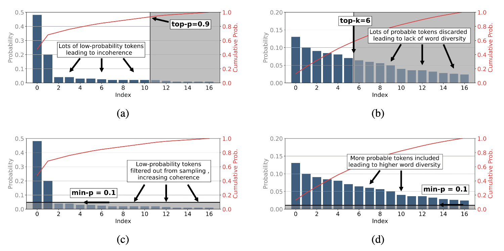

- **Author:** Abdul Dakkak
- **Date:** November 20, 2024

Weight or token sampling in LLM inference is a technique that introduces
randomness and diversity into the text generation process. Instead of selecting
the next token solely based on the highest probability predicted by the model,
weight sampling allows for the selection of less probable tokens based on their
assigned probabilities. This leads to more varied and creative text generation,
making LLMs less predictable and more capable of producing surprising and
engaging outputs.

## Terms

### Weight/token Sampling

Auto-regressive decoding generate output by predicting the next token based on
previous ones, using a vector of logits to represent the probability of each
token. Post-processing techniques are used to control how the next token is
determined, balancing between predictability and creativity. This process of
post processing is called Weight sampling.

### Temperature

In the context of weight sampling, **temperature** is a hyper-parameter that
controls the randomness of the sampling process. It influences the probability
distribution over the possible quantized values for each weight.

- **High temperature:** The sampling becomes more random, and the probability
  distribution is flatter. This means that less likely quantized values have a
  higher chance of being selected.
- **Low temperature:** The sampling is more deterministic, and the probability
  distribution is more concentrated around the most likely quantized values.

By adjusting the temperature (which is an adjustment to the parameter in the
softmax function), one can control the trade-off between exploration (trying
different quantized values) and exploitation (sticking to the most likely
values) during weight sampling. This can impact the final quantized model's
performance and accuracy.

## Algorithms

### Sampling

Randomly selects a token based on the token probability distribution. This
method introduces variety but can lead to nonsensical outputs if not
constrained.

```mojo
def sample(x: Tensor[float], t: float):
  """
  Interprets the logit tensor x as the log(p(i)); or p(i) = exp(x_i * t)
  then returns a sample from the distribution p(i).
  """
  normalization = sum([exp(logit * t) for logit in x])
  cumsum_target = U(0, 1) # uniform random float between [0, 1]
  
  # Note: x doesn't have to be sorted for this to work
  # the likelihood that `cumsum_target` falls within a slice representing
  # token at index `i` is proportional to the "area" covered by the spacing
  # between the cumulative sum 
  # e.g., [0, 0.5, 0.75, 1.0] 
  # corresponds to token likelihoods: p(0) = 0.5, p(1) = 0.25, p(2) = 0.25)
  # If you throw a dart at U(0, 1), you will hit the first half ([0, 0.5]) 
  # 50% of the time, which is consistent with the desire that you select 
  # token 0 50% of the time (and by extension token 1 25% of the time, 
  # and token 2 25% of the time.)
 cumsum = 0
  for i in range(len(x)):
    cumsum += exp(x[i] * t) / normalization
    if cumsum >= cumsum_target:
     return i

 # (Unreachable)
```

### Beam search

Maintains a set of *k* most probable partial sequences and expands them at each
step, considering multiple hypotheses simultaneously. It does that by keeping
track of several possible next tokens for each generation, reducing the chance
of missing high-probability tokens. This method is deterministic and can find
sequences with higher or equal probability than greedy search but requires
performing inference multiple times.

While beam search is a powerful algorithm for certain NLP tasks, its
limitations in terms of diversity and exploration make it less ideal for
sampling in LLMs, especially when more diverse or creative outputs are desired.

### Greedy sampling

Greedy weight sampling selects the token with the highest probability at each
step. This approach is deterministic, meaning it always chooses the most likely
next token based on the model's predictions.

Given a probability distribution $P=\lbrace p_1, p_2, \ldots, p_n \rbrace$ over
the vocabulary, where $p_i$ is the probability of the $i^{th}$ word, the greedy
sampling value is computed by

1. Sort *P* in descending order: $P_{sorted}=\lbrace p_1^′,p_2^′,...,p_n^′
   \rbrace$
2. Select the top 1 word:  $\texttt{arg max}_i = p_i^′$

Greedy sampling differs from stochastic sampling methods like *top-k* and
*top-p* sampling, which introduce randomness into the sampling process to
generate more diverse outputs. While greedy sampling is efficient and
predictable, it may not always produce the most natural or creative text.

#### Implementation

```mojo
fn greedy_sampling(x):
 return argmax(x)
```

### *top-k* sampling

Selects the next word from the top *k* most probable words, allowing for more
diversity compared to greedy sampling. When `k=1` then *top-k* is the same as
greedy sampling.

Given a probability distribution $P=\lbrace p_1, p_2, \ldots, p_n \rbrace$ over
the vocabulary, where $p_i$ is the probability of the $i^{th}$ word, the
*top-k* value is computed by

1. Sort *P* in descending order: $P_{sorted}=\lbrace p_1^′,p_2^′,...,p_n^′
   \rbrace$
2. Select the top K words:  $P_{topk}=\lbrace p_1^′,p_2^′,...,p_K^′ \rbrace$
3. Normalize the probabilities of $P_{topk}$
4. Sample the next word from the normalized probabilities

#### Implementation

```mojo
fn top_k(x, k):
 return sample(sort(x)[:k])
```

### *top-p* sampling

*top-p* sampling, also known as nucleus sampling, is a technique used in LLMs
to control the randomness and quality of generated text. It is designed
to balance creativity and coherence in AI-generated content by
dynamically adjusting the sampling process based on the
probability distribution of the next word in a sequence.

Given a sorted list of word probabilities:

$$
p_1≥p_2≥p_3≥...≥p_n
$$

*top-p* sampling selects the smallest set of words whose cumulative probability
exceeds the threshold

$$
∑_{i=1}^kp_i≥P
$$

Where $k$ is the number of words in the set.

*top-p* sampling is more dynamic than Top-K sampling, which always considers a
fixed number of options. Unlike temperature sampling, which can sometimes
produce odd results, *top-p* sampling adjusts based on the probability
distribution, making it a versatile and effective method for controlling the
quality and diversity of generated text.

#### Implementation

```mojo
fn top_p(x, p):
  accum = 0
  elems = []
  for item in sorted(x):
     accum += item
     if accum >= p
        break
     elem.append(item)
 return sample(elems)
```

### *min-p* sampling

The *min-p* sampling method, conceived as an alternative to *top-p* sampling,
strives to achieve a balance between the coherence and diversity of generated
text. The parameter `p` establishes a dynamic probability threshold for token
selection during the sampling process. This threshold is computed as the
product of `p` and the probability assigned to the most probable token.
Consequently, tokens with logits falling below this calculated threshold are
excluded from consideration.

Given a probability distribution $P=\lbrace p_1, p_2, \ldots, p_n \rbrace$ over
the vocabulary, where $p_i$ is the probability of the $i^{th}$ word, the
*top-k* value is computed by

1. Find the maximum probability value $p_{max} = \texttt{max}(P)$
2. Calculate the base probability threshold: $\texttt{threshold} = p_{max} *
   \texttt{min}(P)$
3. Filter the tokens based on the threshold: $\lbrace i | p_i \ge
   \texttt{threshold} \rbrace$
4. Normalize the filtered probabilities
5. Sample from the normalized filtered tokens

*min-p* sampling differs from *top-k* and *top-p* sampling by its dynamic
nature and ability to adapt to the probability distribution of tokens. Unlike
*top-k*, which selects a fixed number of tokens, and *top-p*, which considers a
cumulative probability threshold, *min-p* sampling uses a relative probability
threshold to filter tokens, making it more flexible and effective in balancing
creativity and coherence.0.

## Comparisons

| Method | Description | Pros | Cons |
| --- | --- | --- | --- |
| **Greedy Sampling** | Selects the highest probability token at each step. | Fast and deterministic | Can lack diversity |
| **Beam Search** | Explores multiple sequences simultaneously, keeping track of top candidates. | Balances exploration and quality | More computationally intensive |
| **Stochastic Sampling** | Introduces randomness by sampling from the probability distribution. | Produces diverse outputs | Less predictable |


/// caption
Effects of *top-p*, *top-k*, and *min-p* sampling on token probability
distributions. *min-p* sampling dynamically adjusts its filtering threshold
based on the model's confidence, focusing on high-probability tokens when
confident and including diverse but plausible options when uncertain. This
helps *min-p* balances coherence and diversity more effectively than *top-p*
and *top-k* sampling. Source: [Minh, et.
al.](https://arxiv.org/pdf/2407.01082), Figure 1.
///

## References

- [The Curious Case of Neural Text
  Degeneration](https://arxiv.org/abs/1904.09751)
- [GPT Runtime - TensorRT-LLM
  Documentation](https://github.com/NVIDIA/TensorRT-LLM/blob/a65dba7aaf7e2d8bb0120eea8f8f04deff145d6a/docs/source/advanced/gpt-runtime.md?plain=1#L160)
- [Controlling Generation with Top-k and Top-p - Cohere
  Documentation](https://docs.cohere.com/docs/controlling-generation-with-top-k-top-p)
- [Token Sampling Primer - Aman AI](https://aman.ai/primers/ai/token-sampling/)
- [Your settings are probably hurting your model - why? -
  Reddit](https://www.reddit.com/r/LocalLLaMA/comments/17vonjo/your_settings_are_probably_hurting_your_model_why/)
- [Sampling - LabML](https://nn.labml.ai/sampling/index.html)
- [Token Sampling Concepts - Vinija
  AI](https://vinija.ai/concepts/token-sampling/)
- [Sampling - Huyenchip's Blog](https://huyenchip.com/2024/01/16/sampling.html)
- [llama.cpp Examples
  README](https://github.com/ggerganov/llama.cpp/blob/d09770cae71b416c032ec143dda530f7413c4038/examples/main/README.md)
- [A Survey of Large Language Model Inference: From Algorithm to
  System](https://arxiv.org/abs/2407.01082)
- [Customizing LLM Output: Post-Processing Techniques - Neptune
  AI](https://neptune.ai/blog/customizing-llm-output-post-processing-techniques)
- [The Unreasonable Effectiveness of Transformer Language Models in Grammatical
  Error Correction](https://arxiv.org/abs/1811.03115)
- [Min-P Sampling: A Simple and Effective Alternative to Top-P
  Sampling](https://arxiv.org/abs/2407.21787)
- [A Survey of Large Language Model Inference: From Algorithm to
  System](https://arxiv.org/abs/2407.10457)
- [Explained Completions - Interactive Token Sampling
  Visualization](https://explained-completions.netlify.app/)
- [Token Sampling Interactive Demo - Google
  Colab](https://colab.research.google.com/drive/18-2Z4TMua-nwgCpIZo0lsKL6RDxH5Bvo?usp=sharing)
