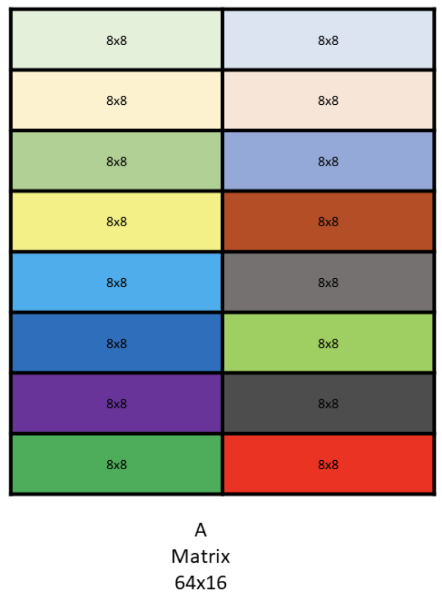
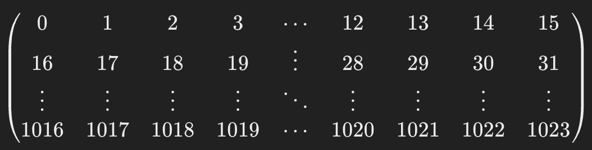
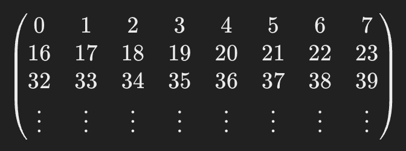
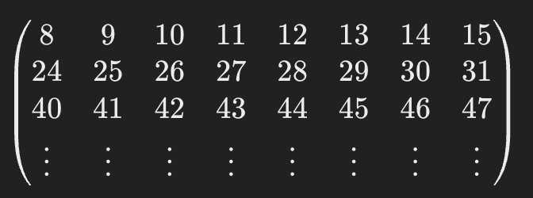
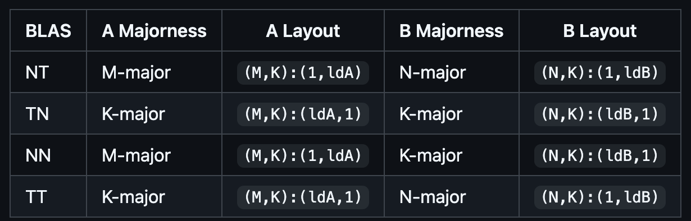
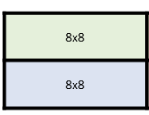
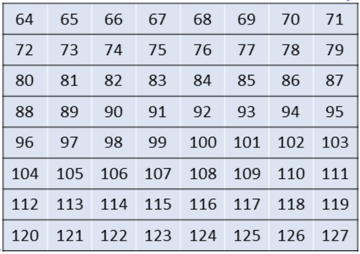
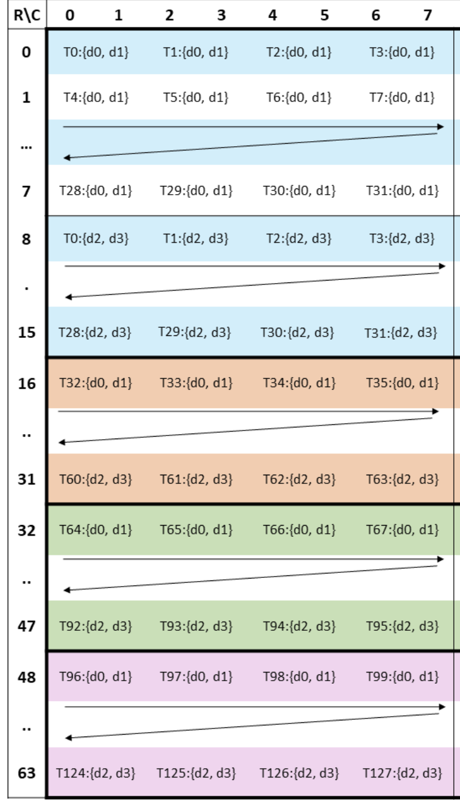

Hopper (H100) introduced a new tensor core instruction called Warp Group MMA
(WGMMA).  The regular Matrix Multiply-Accumulate (MMA) tensor core instructions
are warp scoped and map onto a single subcore of a Streaming Multiprocessor
(SM). An SM is divided into 4 subcores. Instead of using a single warp, a WGMMA
instruction uses 4 warps (ie 128 threads) and maps onto an entire SM. It has
much bigger tile sizes than the regular MMA instruction.

- WGMMA executes the operation `D = A*B + C` where `C` can be disabled to only
  do matrix multiplication of `A` & `B`.
- For WGMMA instructions the matrix tile `A` can be registers or shared memory
  but `B` has to be in shared memory. It's important to know how values are
  arranged in shared memory for wgmma to correctly compute the operation.

Lets look at example `m64n8k16` (bf16) with both `A` & `B` in shared memory.
Shared memory has the advantage that Tensor Memory Accelerator (TMA) can be
used to move data from global to shared memory.

So `A` matrix is of the shape `64x16` while `B` is of the shape `16x8`:



Here `8x8` is referred to as the core matrix. Each of the core matrix can only
have 8 rows or columns and row size being 16 bytes. So our matrix `A` has `8x2
⇒ 16` core matrices.

Lets consider the example where matrix `A` is row major and elements start from
0 to 1023 (increasing by 1).

Logically this would be represented like this:



But shared memory for `A` is like a 1-D contiguous space in memory.

From 0 to 511 elements it would look like this:



Now from 512 to 1023 elements it would be:



Now lets look how `B` matrix is arranged in shared memory. Lets assume the
default case where `B` matrix is in column major order and it also contains
values starting from 0 to 127.  (NT is the BLAS notation). Here are the various
representations:



So `B` matrix is of the shape `16x8`. So it has 2 core matrices:



So its gonna be like this:


Where 0 is the first element in shared memory, 8 is the next, then 16, then 24,
after 56 it goes to 1. After 63 it goes to the next core matrix and 64
(repeating the same way).



The result will be stored in the registers. It will be of the form:



Here `T0` is thread 0 storing the first 2 final values in its 2 registers.
Every thread will have 4 registers.

Here is the CUDA implementation of the this example:

```cpp

__device__ void wgmma_8(uint64_t const &desc_a, uint64_t const &desc_b, float d[4]) {

    constexpr int32_t ScaleD = 1;
    constexpr int32_t ScaleA = 1;
    constexpr int32_t ScaleB = 1;
    constexpr int32_t TransA = 0;
    constexpr int32_t TransB = 0;

    asm volatile(
        "{\n"
        "wgmma.mma_async.sync.aligned.m64n8k16.f32.bf16.bf16 "
        "{%0,   %1,   %2,   %3},"
        " %4,"
        " %5,"
        " %6, %7, %8, %9, %10;\n"
        "}\n"
        : "+f"(d[0]), "+f"(d[1]), "+f"(d[2]), "+f"(d[3])
        : "l"(desc_a), "l"(desc_b), "n"(int32_t(ScaleD)), "n"(int32_t(ScaleA)),
          "n"(int32_t(ScaleB)), "n"(int32_t(TransA)), "n"(int32_t(TransB)));
}
__device__ void warpgroup_fence_operand(uint32_t &reg) {
    asm volatile("" : "+r"(reg)::"memory");
}

__device__ void warpgroup_arrive() {
    asm volatile("wgmma.fence.sync.aligned;\n" ::: "memory");
}

__device__ void warpgroup_commit_batch() {
    asm volatile("wgmma.commit_group.sync.aligned;\n" ::: "memory");
}

template <int N>
__device__ void warpgroup_wait() {
    static_assert(N >= 0 && N <= 7, "WGMMA wait: N must be in range [0, 7]");
    asm volatile("wgmma.wait_group.sync.aligned %0;\n" ::"n"(N) : "memory");
}
__device__
uint64_t insert_bit(uint32_t start_bit, uint64_t target, uint64_t val)
{
    return target | (val << start_bit);
}

template <class PointerType>
__device__ uint64_t make_desc(PointerType smem_ptr, int sbo, int lbo) {

  uint64_t desc = 0;
  uint32_t base_ptr = static_cast<uint32_t>(__cvta_generic_to_shared(smem_ptr));
  uint32_t start_address = base_ptr >> 4;
  uint64_t swizzle = 0;
  uint64_t offset = 0;

  desc = insert_bit(62, desc, swizzle);
  desc = insert_bit(49, desc, offset);
  desc = insert_bit(32, desc, (uint64_t)sbo);
  desc = insert_bit(16, desc, (uint64_t)lbo);
  desc = insert_bit(0, desc, start_address);
  return desc;
}
//  A is row major and B is column major
__global__ void test_wgmma_8(float* C) {

    __shared__ bf16 A[64*16];
    __shared__ bf16 B[16*8];

    int tid = threadIdx.x;
    int wid = tid / 32;
    int lid = tid % 32;

    for (int i = 0; i < 8; i++)
    {
        int ind = ((tid % 2) * 512) + ((tid / 2) * 8 + i);
        float val = (tid * 8) + i;  
        A[ind] = (bf16)(val);
    }

    int xtid = tid % 64;
    float val = (tid / 64) * 64 + ((xtid % 8) * 8) + (xtid / 8);    
    B[tid] = (bf16)val;

    __syncthreads();

    uint64_t desc_a = make_desc(A, 8, 64);
    uint64_t desc_b = make_desc(B, 1, 8);

    float d[4];
    memset(d, 0, sizeof(d));

    warpgroup_arrive();
    wgmma_8(desc_a, desc_b, d);

    warpgroup_commit_batch();
    warpgroup_wait<0>();

    C[wid * 128 + (lid * 2)] = d[0];
    C[wid * 128 + (lid * 2) + 1] = d[1];
    C[wid * 128 + 64 + (lid * 2) ] = d[2];
    C[wid * 128 + 64 + (lid * 2) + 1] = d[3];
}
void run_8()
{
    dim3 grid(1);
    dim3 thread(128);

    int size = 64*8*sizeof(float);
    float* hC = (float*)malloc(size);
    float* dC;
    cudaMalloc((void**)&dC, size);
    test_wgmma_8<<<grid, thread>>>(dC);
    cudaDeviceSynchronize();
    cudaMemcpy(hC, dC, size, cudaMemcpyDeviceToHost);

    printf("---------res--------\n");
    for(int i = 0; i < 64; i++)
    {
        for (int j = 0; j < 8; j++)
        {
            printf("%f ",hC[i * 8 + j]);
        }
        printf("\n");
    }

}
```

Now lets consider the case when `B` is also row major—ie transposed (denoted by
`B'`). Two things would need to changed for it to work correctly. First is
there are 2 flags the WGMMA instruction takes `A'` and `B'`, by default they
are set to 0 which indicates `A` is row major and `B` is column major. Now if
we want to make `B` as row major `B'` has to be set to 1. Next thing to change
is how `B` matrix values are mapped onto shared memory.  For the example
discussed above it becomes `B = [1 2 3 4 5 …. ]`, it just maps onto the thread
ids.
