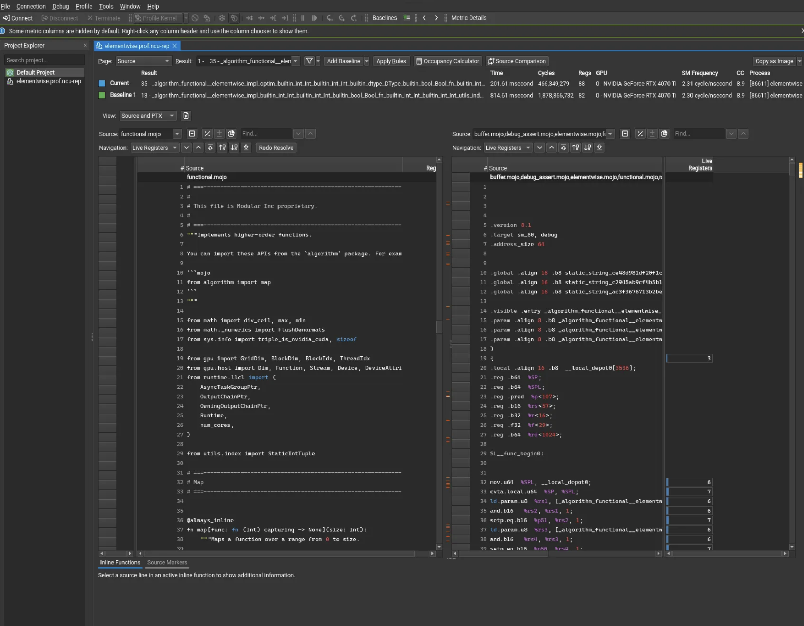

# Kernel profiling with Nsight Compute

Nsight Compute is a tool for evaluating individual kernel performance on
NVIDIA hardware.

Here's a screengrab of a sample profile opened in Nsight Compute:



## Installation

**Follow the instructions on the
[install page](https://developer.nvidia.com/tools-overview/nsight-compute/get-started)**

At time of writing, those steps were:

1. [Download](https://developer.nvidia.com/tools-overview/nsight-compute/get-started)
  the `.run` installer for Linux systems.

2. Modify the permissions in the installer and execute with:

    ```bash
    sudo base nsight-compute-linux-2025.2.0.12-33266684.run
    ```

3. Build the binary:

    ```bash
    mojo build --debug-level=line-tables -o a.out my_file.mojo
    ```

4. In your remote environment (the one connected to the NVIDIA GPU), run the
  following command:

    ```bash
    /usr/local/cuda/bin/ncu --set full -f -o <output_build_name> --import-source yes \
      --source-folder /home/ubuntu/modular /home/ubuntu/modular/<file_name.mojo>
    ```

You should see a file called `output_build_name.ncu-rep` in the directory. This
will generate a built file with everything you need to profile.

## Usage

Once installed, you can:

- SCP the build into your local machine
- Drag and drop to Nsight
- Profile it

You can also do this process remotely:

- SSH into the remote environment:

- Open the Start Activity Dialog, select an SSH-capable Target Platform, and
    click the + button
- Choose your authentication method:
  - Password: enter IP/hostname, username, password, port (default is 22),
      deployment directory, and optionally a connection name
  - Private Key: enter IP/hostname, username, private key path, passphrase,
      port, deployment directory, and optionally a connection name
  - If using Coder, the default username and password is `ubuntu`, and the
      default IP is `coder.workspace_name.main`

- Select Target Application (per profiling session)

- Select the remote connection in the Start Activity Dialog
- Browse the remote file system over SSH
- Select the *compiled binary* of the kernel you want to profile
- You are responsible for compiling this binary outside Nsight Compute (see
    above commands to compile)

- Launch Activity (what Nsight Compute does)

- Copies required profiling tools (e.g., `ncu`, support files) to the
    deployment directory on the remote machine
- Executes the selected binary on the remote device

- Viewing

- A report file (e.g., `.ncu-rep`) generated in the deployment directory on
    the remote device
- This report is copied back to the host and opened in the UI
- All actions (file transfers, tunneling, execution, report retrieval) are
    logged in the Progress Log inside Nsight Compute

You are now ready to profile any kernels!
