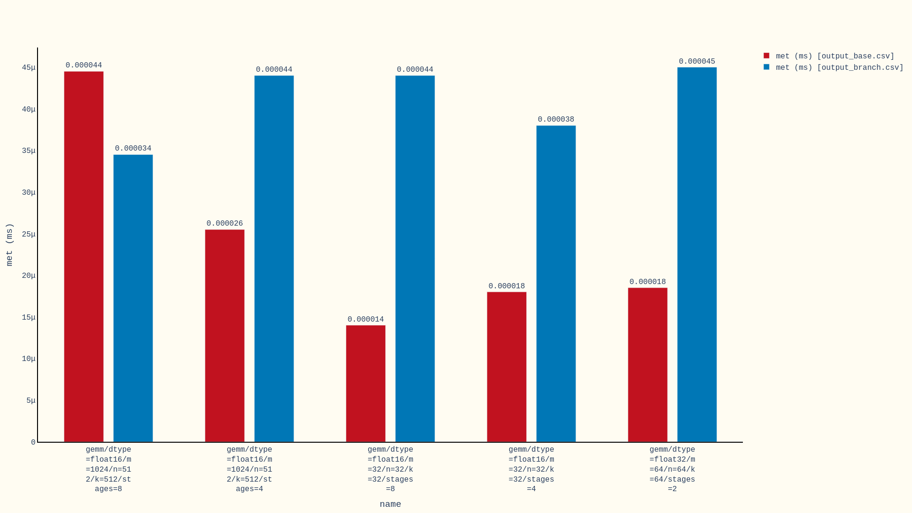

# `kplot`: Drawing bar plots for `kbench` results

```plaintext
Options:
  --label TEXT            List of corresponding labels for CSV files (can have
                          multiple ones).
  -o, --output TEXT       Path to output file.
  -p, --plot-col INTEGER  Plot column.
  -c, --compare           Compare csv's, using the first one as the baseline.
  -x, --extension TEXT    output extension
  -f, --force             Force matching input sets.
  -v, --verbose           Verbose printing.
  --help                  Show this message and exit.
```

`kplot` generates 1920x1080 diagrams with maximum of 10 bar plots per image.

- First, get the output by running configs through `kbench` (the following are
only for demo purposes and don't contain valid data):

    ```bash
    kbench test.yaml -o output_base.csv
    kbench test.yaml -o output_branch.csv
    kbench test.yaml -o output_cublas.csv
    ```

    Result: [output_base.csv](data/output_base.csv),
    [output_branch.csv](data/output_branch.csv),
    [output_cublas.csv](data/output_cublas.csv)

- Simply pass resulting csv files of `kbench` to `kplot`, this will generate
`.png` images as output:

    ```bash
    kplot output_base.csv output_branch.csv -o base_vs_branch
    ```

    Result: 

- Associate labels to each csv file (assigned in the same order added):

    ```bash
    kplot output_base.csv output_branch.csv --label="baseline" --label="experiment"
    ```

    Result: 

- Columns should be `"name" (0), "met (ms)" (1), "iters" (2)`:

    ```bash
    kplot output_base.csv output_branch.csv -p [1,2]
    ```

- Compare the results by using the entries from the first csv as the baseline:

    ```bash
    kplot output_base.csv output_branch.csv -c
    ```

    Result: 

- To generate `.pdf` simply add `-x pdf`:

    ```bash
    kplot output_base.csv output_branch.csv -x pdf
    ```

    Result: 

- If the entries in column `name` are not matching, then simply add `-f` or `--force`:

    ```bash
    kplot output_base.csv output_branch.csv output_cublas.csv -f
    ```

    Result: 
    Result: 
